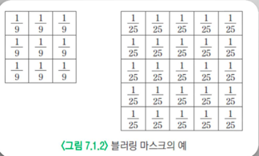

# 11.1 Blur
## 블러링
### 블러링 현상
-  디지털카메라로 사진 찍을 때, 초점이 맞지 않으면 → 사진 흐려짐
- 이러한 현상을 이용해서 영상의 디테일한 부분을 제거하는 아웃 포커싱(out focusing) 기법

### 블러링(blurring)
- 영상에서 화소값이 급격하게 변하는 부분들을 감소시켜 점진적으로 변하게 함으로써 영상이 전체적으로 부드러운 느낌이 나게 하는 기술
- 화소값이 급격히 변화하는 것을 점진적으로 변하게 하는 방법

### 가우시안 스무딩 필터링
#### 스무딩
- 회선을 통해서 영상의 세세한 부분을 부드럽게 하는 기법
- 대표적인 방법 - 가우시안 필터링

#### 가우시안 분포(정규 분포)
- 특정 값의 출현 비율을 그래프로 그렸을때, 평균에서 가장 큰 수치 가짐
- 평균을 기준으로 좌우 대칭 형태
- 양끝으로 갈수록 수치가 낮아지는 종 모양
$$N(\micro, \sigma)(x)=\frac{1}{\sigma\sqrt{2\pi}}\exp(-\frac{(x-\micro)^2}{2\sigma^2})$$

## 에지 검출

### 1차 미분 마스크
#### 미분
- 함수의 순간 변화율을 구하는 계산 과정
- 에지가 화소의 밝기가 급격히 변하는 부분이기 때문에 함수의 변화율을 취하는 미분 연산을 이용해서 에지 검출 가능

#### 밝기의 변화율을 검출하는 방법
- 밝기에 대한 기울기를 계산
